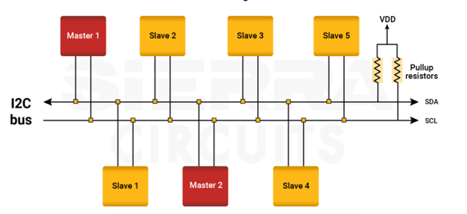
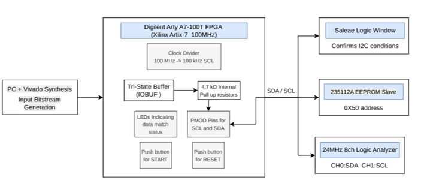
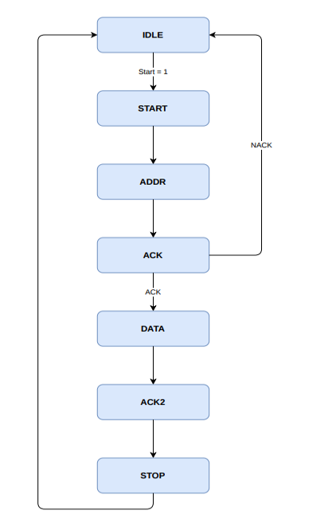
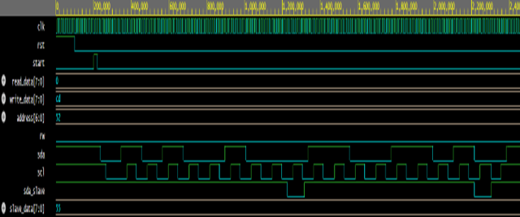
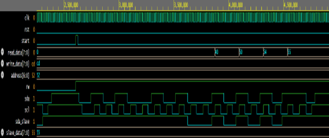
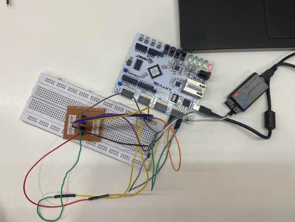
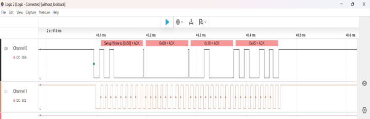
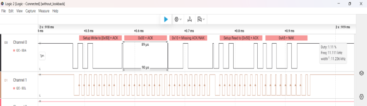

# I2C Protocol Using Verilog

## Overview

This project presents the design, simulation, and FPGA implementation of an FSM-based Inter-Integrated Circuit (I2C) Master Controller using Verilog HDL.

The design was successfully implemented on a Digilent Arty A7-100T FPGA board and interfaced with a 24512A EEPROM device to perform memory write and read operations through the I2C bus.

The controller supports START/STOP generation, slave addressing, ACK/NACK detection, repeated START operations, EEPROM interfacing, and hardware validation using a Logic Analyzer.

---

## Features

- FSM-Based I2C Master Controller
- Repeated START Support
- ACK/NACK Detection
- 7-Bit Slave Addressing
- 16-Bit EEPROM Memory Addressing
- Bidirectional SDA Communication
- Clock Divider Based SCL Generation
- FPGA Hardware Implementation
- Logic Analyzer Verification
- Read-Back Data Verification
- LED-Based Status Indication

---

## I2C Bus Architecture

The I2C bus consists of a master device and one or more slave devices connected through SDA and SCL lines.

The master generates the clock signal and initiates communication, while slave devices respond when their address is detected on the bus.



---

## System Architecture

The proposed system consists of:

- Digilent Arty A7-100T FPGA
- FSM-Based I2C Master Controller
- 24512A EEPROM Slave Device
- Clock Divider
- Tri-State SDA Interface
- Push Button Control
- LED-Based Status Indication
- Logic Analyzer Verification

The FPGA performs EEPROM write and read operations and verifies successful communication by comparing transmitted and received data.




---

## Clock Architecture

The Digilent Arty A7-100T FPGA provides a 100 MHz system clock.

A clock divider is implemented to generate the standard I2C clock frequency of:

```text
100 MHz → 100 kHz
```

The generated SCL signal synchronizes communication between the FPGA and EEPROM.

---

## I2C Master Design

### Features

- FSM-Based Architecture
- Read and Write Support
- ACK/NACK Detection
- Clock Divider Based SCL Generation
- Tri-State SDA Implementation
- 7-Bit Slave Addressing
- Protocol-Compliant Communication


## Finite State Machine (FSM)

The I2C Master Controller is implemented using a 7-State FSM.

### FSM States

| State | Function |
|---------|----------|
| IDLE | Wait for transaction request |
| START | Generate START condition |
| ADDR | Transmit slave address |
| ACK | Verify slave acknowledgement |
| DATA | Transfer data |
| ACK2 | Verify acknowledgement after data |
| STOP | Generate STOP condition |

### FSM State Diagram



---

## EEPROM Interfacing

The FPGA communicates with a 24512A EEPROM using the I2C protocol.

### EEPROM Write Operation

The write operation consists of:

1. START Condition
2. EEPROM Address + Write Bit
3. High Byte Memory Address
4. Low Byte Memory Address
5. Data Byte
6. STOP Condition

### EEPROM Read Operation

The read operation consists of:

1. START Condition
2. EEPROM Address + Write Bit
3. Memory Address
4. Repeated START
5. EEPROM Address + Read Bit
6. Read Data Byte
7. NACK
8. STOP Condition
   
---

## Simulation

### Write Operation



### Read Operation




---

## FPGA Hardware Implementation

After successful simulation, the design was implemented on the Digilent Arty A7-100T FPGA board.


### Hardware Setup



---

## Logic Analyzer Verification

The implemented design was validated using:

- 24 MHz 8-Channel Logic Analyzer
- Saleae Logic 2 Software

### EEPROM Write Transaction



### EEPROM Read Transaction



---
## Hardware Used

- Digilent Arty A7-100T FPGA Board
- 24512A EEPROM
- 24 MHz 8-Channel USB Logic Analyzer
- Breadboard
- Jumper Wires
- USB Programming Cable

---

## Software and Tools Used


- Xilinx Vivado Design Suite
- EDA Playground
- Saleae Logic 2 Software

---

## Applications

- EEPROM Interfacing
- Sensor Communication
- Real-Time Clock (RTC) Systems
- Embedded Systems
- FPGA-Based Designs
- Industrial Automation
- Consumer Electronics
- IoT Applications

---


## Author

**Nensi Thummar**

Electronics and Communication Engineering

Nirma University

---

## References

1. NXP Semiconductors – I2C-Bus Specification and User Manual
2. Microchip 24LC512 / 24512A EEPROM Datasheet
3. Xilinx Vivado Design Suite Documentation
4. Digilent Arty A7 FPGA Reference Manual
5. Samir Palnitkar – Verilog HDL: A Guide to Digital Design and Synthesis
6. M. Morris Mano – Digital Design
